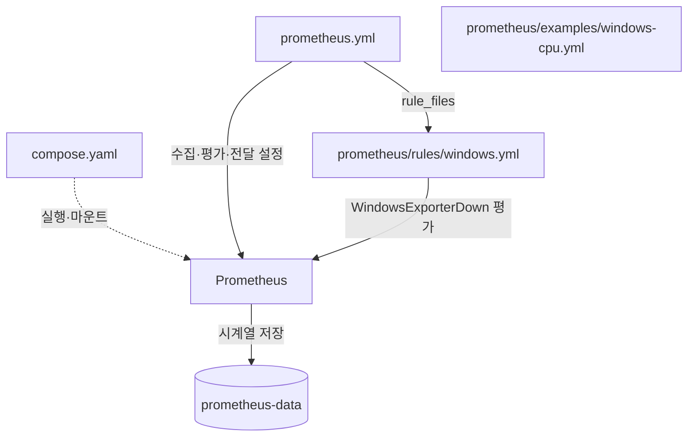
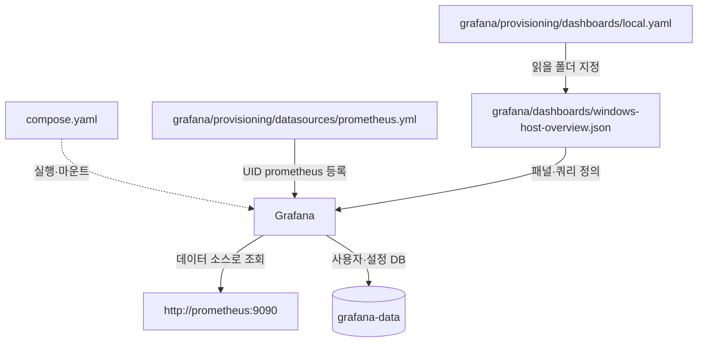
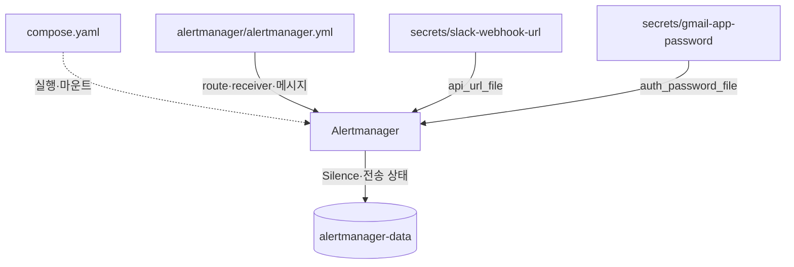
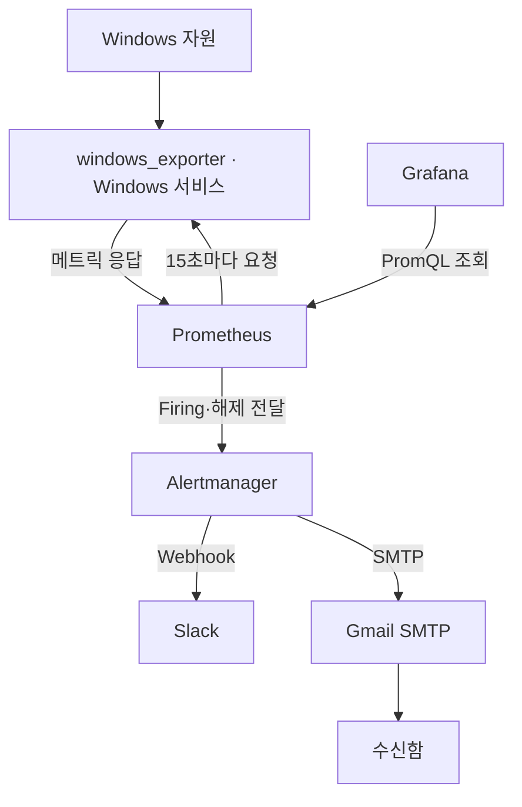
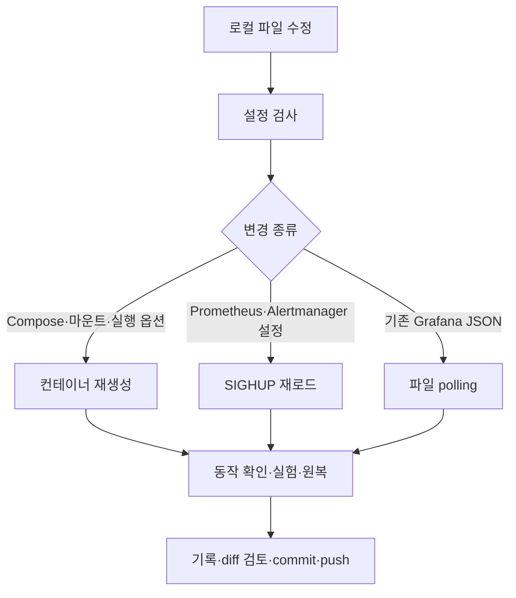
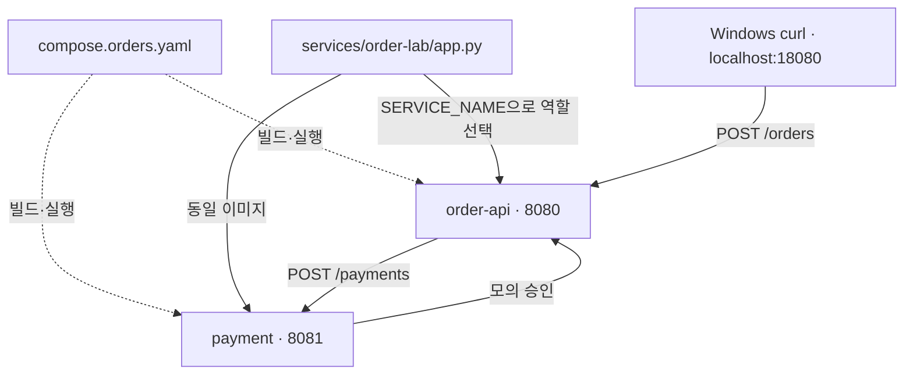

# 파일·컨테이너·데이터 관계도

기준 폴더: `C:/Users/PC/Desktop/git-devops/observability-lab`.
현재 1~3장 검증 구성과 4-1장 추가 소스를 구분한다. 아래 Mermaid는 GitHub와 Obsidian의 Mermaid 지원 화면에서 볼 수 있다.
[챕터 지도](roadmap.md) · [4장 실행 가이드](chapters/04-order-api.md)

## 1. Prometheus 파일 관계

점선은 실행·마운트 정의, 실선은 설정 참조 또는 데이터 접근이다.
CPU 예제 파일은 `rules/*.yml` 밖에 있어 현재 평가되지 않는다.

## 2. Grafana 파일 관계

provider의 polling은 30초이며 allowUiUpdates=false다. JSON은 화면 정의이고 메트릭 이력이 아니다.

## 3. Alertmanager 파일 관계

인증 파일은 로컬에만 제공한다. .gitignore의 /secrets/는 Git 제외이며 암호화가 아니다.
원격 이메일 설정은 주소가 설명용 문구로 되어 있으므로, 재현 시 실제 발신·수신·인증 계정으로 치환해야 한다.

## 4. 마운트 대응표

| 저장소 경로 | 컨테이너 | 내부 경로 |
|---|---|---|
| prometheus.yml | prometheus | /etc/prometheus/prometheus.yml |
| prometheus/rules/ | prometheus | /etc/prometheus/rules/ |
| grafana/provisioning/ | grafana | /etc/grafana/provisioning/ |
| grafana/dashboards/ | grafana | /var/lib/grafana/dashboards/ |
| alertmanager/alertmanager.yml | alertmanager | /etc/alertmanager/alertmanager.yml |
| secrets/slack-webhook-url | alertmanager | /run/secrets/slack-webhook-url |
| secrets/gmail-app-password | alertmanager | /run/secrets/gmail-app-password |

같은 Compose에 선언해도 서비스마다 보이는 파일이 다르다.
named volume은 실행 데이터, Git 파일은 구성 소스, secrets는 인증 정보다.

## 5. 실행 데이터 흐름

Grafana는 현재 알림 평가 주체가 아니다. 외부 통신 실패 시 그래프와 알림 전달 상태를 별도로 진단한다.

## 6. 변경 적용 흐름

push는 배포가 아니다. 다른 PC는 pull 후 적용 절차가 필요하다.
Grafana provisioning YAML·마운트 변경은 JSON polling과 구분해 재시작·재생성한다.

## 7. 4-1장 추가 구성

4-1에서는 API 정상 경로만 제공한다. /metrics와 Prometheus 수집 연결은 4-2에서 추가한다.
payment는 호스트 포트를 공개하지 않는다. 주문은 영구 저장하지 않고 실제 결제를 수행하지 않는다.
