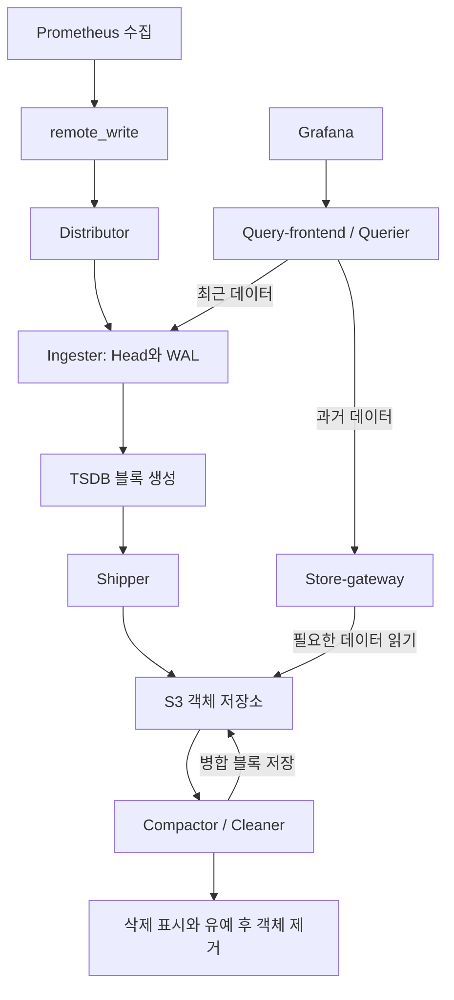
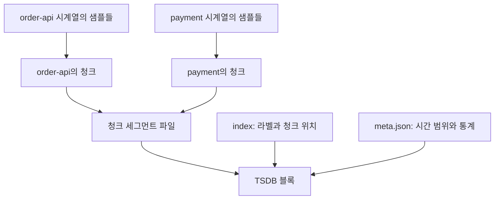

# 7-9. Mimir 구성요소별 장애 증상과 TSDB 데이터 구조

- 작성일: 2026-09-26 (KST)
- 관련 실습: 007 Mimir
- 문서 유형: 개념 및 장애 대응 참고 자료
- 권장 경로: `docs/evidence/007-mimir/7-9-components-and-tsdb-guide.md`

> 구성요소별 장애 표는 역할을 기준으로 한 예상 영향이다. 모든 장애를 실제 주입해 검증한 결과는 아니다. 이번 실습은 Classic 아키텍처이며, 하나의 Mimir 프로세스 안에서 여러 구성요소가 동작한다. 따라서 컨테이너 중단 시 여러 기능이 함께 중단된다.

## 1. 전체 데이터 경로



## 2. 구성요소별 장애 증상

실제 영향은 복제 구성, 영속 디스크, 캐시, 장애 지속 시간에 따라 달라진다.

| 장애 지점 | 주요 증상 | 데이터 영향 | 우선 확인 |
|---|---|---|---|
| 수집 대상 / Exporter | 해당 대상의 up=0, 메트릭 갱신 중단 | 수집하지 못한 값은 일반적으로 사후 복원 불가 | Targets, 대상 연결·응답 |
| Prometheus | 여러 대상의 수집·전송 중단 | 수집 공백 발생. 기존 Mimir 데이터 조회는 가능할 수 있음 | 프로세스, 디스크, scrape 상태 |
| remote_write 경로 | Prometheus에는 최신 값이 있지만 Mimir에는 지연 | 대기·재시도 발생, 장기 장애는 미전송 데이터 유실 가능 | 전송 오류, 대기량, 전송 지연 |
| Distributor | Mimir 쓰기 요청 실패·지연 | 신규 수신에 영향, 기존 데이터 조회는 가능할 수 있음 | 수신 오류, 제한 설정, Ingester 연결 |
| Ingester | 쓰기 또는 최근 조회 실패 | 복제와 영속 볼륨 상태에 따라 복구 가능성 달라짐 | 준비 상태, 링, WAL 재생, 디스크 |
| Shipper / 업로드 경로 | 최근 조회는 되지만 새 S3 블록이 생기지 않음 | 장기 저장 지연 및 로컬 블록 적체 | 업로드 실패, 마지막 성공 시각, S3 연결 |
| S3 / object-store | 업로드 실패, 과거 조회 오류·지연 | 최근 데이터는 Ingester에서 조회 가능할 수 있음. 장기 장애 시 위험 증가 | S3 응답, 인증, 네트워크, 용량 |
| Store-gateway | 과거 조회 실패, 최근 조회는 정상일 수 있음 | S3 데이터 자체의 삭제를 의미하지 않음 | 블록 로드, 링, S3 읽기 오류 |
| Querier / Query-frontend | 조회 API 오류·시간 초과 | 수집·저장은 계속될 수 있음 | 쿼리 오류, 대기열, 자원, 하위 연결 |
| Compactor / Cleaner | 병합·보존 만료 삭제 지연 | 블록 수·저장량 증가, 장기적으로 조회 효율 영향 | 마지막 성공 작업, 실패 로그, 작업 디스크 |
| Grafana | 접속·패널 표시 실패 | Mimir 수집·저장은 정상일 수 있음 | Grafana 상태, 데이터 소스, Mimir API 직접 조회 |

### 진단 시작점

| 관측 상황 | 우선 점검 경로 |
|---|---|
| Prometheus에도 최신 값이 없음 | 대상 → scrape → Prometheus |
| Prometheus에는 있지만 Mimir에는 없음 | remote_write → Distributor → Ingester |
| 최근 값은 보이지만 과거 값이 안 보임 | Store-gateway → S3 |
| Mimir API는 정상이고 Grafana만 실패 | Grafana → 데이터 소스 설정 |
| 조회는 정상인데 저장량이 계속 증가 | Compactor → 보존 설정 → 삭제 처리 |

- 조회 실패를 데이터 유실로 단정하지 않는다. 읽기 경로만 고장 났을 수 있다.
- 수집 성공과 원격 전송 성공은 별도로 확인한다.
- remote_write 재시도는 무제한 보관을 뜻하지 않는다. WAL 정리와 장애 지속 시간에 따라 미전송 데이터가 유실될 수 있다.
- Shipper는 Ingester의 업로드 기능이며 이번 실습에서 별도 컨테이너가 아니다.
- 재시작 후 WAL 복구가 가능하려면 해당 로컬 저장소가 유지되어야 한다. 단일 인스턴스 실습은 운영 고가용성 검증이 아니다.

## 3. 시계열과 샘플: 실제 메트릭 예시

다음 예시는 설명용이다. 포트와 수집 간격은 실제 저장소 설정을 확인한 값이 아니다.

```promql
up{job="order-api", instance="order-api:8000"}
```

메트릭 이름과 전체 라벨 조합이 하나의 시계열을 식별한다.

| 시각 | 값 | 의미 |
|---|---:|---|
| 10:00:00 | 1 | 수집 성공 |
| 10:00:15 | 1 | 수집 성공 |
| 10:00:30 | 0 | 수집 실패 |
| 10:00:45 | 1 | 수집 성공 |

위 예시는 **시계열 1개, 샘플 4개**다. 값이 바뀌어도 시계열이 새로 생기지 않는다. `up=1`은 메트릭 수집 성공이며 주문 업무 전체의 정상을 보장하지 않는다.

다음 라벨 조합은 별도 시계열이다.

```promql
up{job="payment", instance="payment:8001"}
```

| 대상 | 시계열 수 | 각각 4번 수집한 샘플 수 |
|---|---:|---:|
| order-api | 1 | 4 |
| payment | 1 | 4 |
| 합계 | 2 | 8 |

## 4. 청크와 블록: 저장 구조



그림은 각 시계열의 샘플을 청크 하나로 표현한 단순화다. 실제 청크 분할은 저장 구현과 데이터에 따라 달라진다.

| 개념 | 뜻 | 주의할 점 |
|---|---|---|
| 시계열 | 같은 메트릭 이름·전체 라벨 조합의 시간별 데이터 흐름 | 논리적 식별 단위 |
| 샘플 | 해당 시계열의 특정 시각과 값 | 여기서는 숫자 값을 가진 up 메트릭 예시 |
| 청크 | 한 시계열의 샘플들을 압축한 저장 묶음 | 한 시계열에 여러 청크가 생길 수 있음 |
| 청크 세그먼트 파일 | 여러 청크를 담는 파일 | chunks/000001 하나가 청크 하나라는 뜻은 아님 |
| 블록 | 일정 시간 범위의 청크·색인·메타데이터 묶음 | 여러 시계열 포함 가능. 같은 시계열도 여러 시간대 블록에 걸침 |
| ULID | 블록 식별 ID | 블록 생성 시각과 내부 데이터 시각은 다를 수 있음 |

블록의 주요 파일:

- `meta.json`: 블록 ID, 시간 범위, 시계열·샘플·청크 수 등의 메타데이터
- `index`: 라벨을 기준으로 시계열과 청크 위치를 찾는 색인
- `chunks/000001`: 실제 샘플을 담은 청크들이 저장되는 세그먼트 파일

### 실습 관측값과 연결

| 블록 | 시계열 | 샘플 | 청크 |
|---|---:|---:|---:|
| 보존 만료 테스트: 01M3CEKGHCAVMYZCFNKQH3WAJH | 1 | 3 | 1 |
| 일반 블록: 01M3BNTR6G0063CGZQDM31ZQ49 | 10,065 | 4,685,316 | 31,676 |

일반 블록에서는 청크 세그먼트 파일 `chunks/000001` 하나와 메타데이터의 청크 수 31,676개를 확인했다. 파일 개수와 청크 개수는 다르다.

## 5. Head, WAL, compaction의 관계

- **Head**: 아직 블록으로 정리되지 않은 데이터를 관리한다. 블록이 없어도 조회 가능한 데이터가 있을 수 있다.
- **WAL**: 장애·재시작 시 복구를 위한 쓰기 기록이다. 애플리케이션 로그 조회 기능과 다르다.
- **Ingester compaction**: Head 데이터를 TSDB 블록으로 정리한다.
- **Shipper**: 생성된 블록을 S3에 업로드한다.
- **Compactor compaction**: S3의 기존 블록을 병합한다. 보존 만료 정리도 Compactor의 역할이다.

따라서 '2시간마다 처음 저장된다'고 설명하지 않는다. 수신 시 Head와 WAL에 반영되고, 이후 블록 생성·S3 업로드가 이어진다. 블록 범위 설정은 정확히 매 2시간 벽시계 시각에 업로드가 끝난다는 보장이 아니다.

## 6. 실무 핵심

| 변경 | 주로 증가하는 것 |
|---|---|
| 동일 대상의 수집 간격 단축 | 같은 시계열의 샘플 수 |
| 새로운 메트릭·라벨 조합 추가 | 시계열 수 |
| 요청마다 새로운 request_id 라벨 추가 | 지속적으로 새로운 시계열 생성 |

시계열 수를 카디널리티라고 부른다. 수집 빈도와 카디널리티는 모두 부하에 영향을 주지만 서로 다른 축이다.

고객 설명 예시:

> 시계열은 무엇을 측정하는지 구분하는 이름표이고, 샘플은 그 대상의 특정 시각 측정값입니다. 여러 측정값을 청크로 압축하고, 청크와 검색 정보를 블록으로 묶어 저장합니다. 장애가 나면 수집·전송·저장·조회 중 어느 단계가 멈췄는지 구분해야 합니다.

## 7. 참고 자료

- [Grafana Mimir Classic 아키텍처](https://grafana.com/docs/mimir/latest/get-started/about-grafana-mimir-architecture/about-classic-architecture/)
- [Grafana Mimir 구성요소](https://grafana.com/docs/mimir/latest/references/architecture/components/)
- [Prometheus remote_write 운영 지침](https://prometheus.io/docs/practices/remote_write/)
- [Prometheus 데이터 모델](https://prometheus.io/docs/concepts/data_model/)
- [Prometheus 저장 구조](https://prometheus.io/docs/prometheus/latest/storage/)

공식 문서는 최신 버전 기준으로 변경될 수 있다. 이번 실습 관측값은 Mimir 3.2.1 환경의 기록이다.

