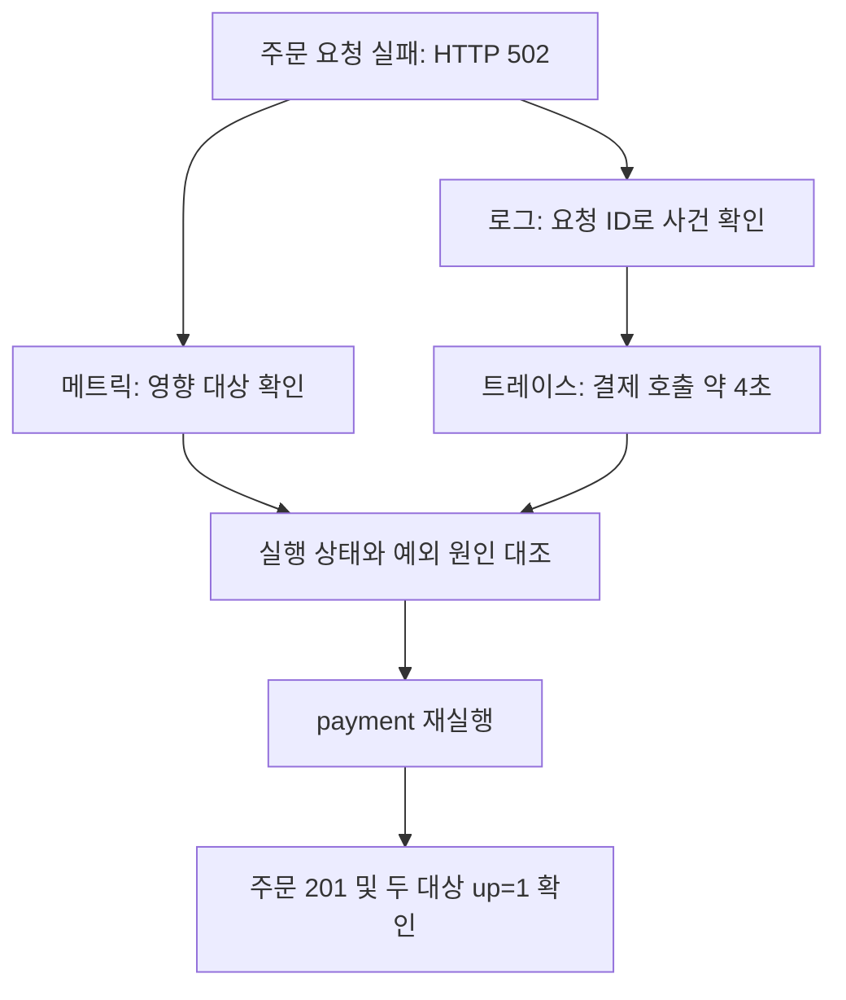

# 8-3 payment 중단·관측·복구

실습일: 2026-10-03 KST. 브랜치: `lab/008-integrated-incident`.
근거: 사용자가 Windows Git Bash에서 실행한 출력과 Grafana Loki·Tempo 화면. 아래 기록은 원본 출력의 핵심 필드를 정리한 것으로, 전체 원본 로그나 이미지 파일을 포함하지 않는다.

## 1. 목표와 판정

payment를 중지해 주문 실패를 재현하고, HTTP 응답·로그·트레이스·수집 상태를 연결한 뒤 서비스를 복구한다.

**판정: 정상 주문 → payment 중단에 따른 주문 실패 → payment 재실행 후 주문 성공 및 메트릭 수집 복구 확인.**

단일 요청 중심의 기능 검증이다. 지속 안정성, 경보 전달, 자동 복구 및 전체 요청의 장애율은 검증하지 않았다.

## 2. 사전 조건

- order-api와 payment 모두 `healthy`.
- 실행 중 payment의 `PAYMENT_DELAY_SECONDS='0.08'`.
- 실행 중 order-api의 `PAYMENT_TIMEOUT_SECONDS='2'`.
- IPv4 요청: `curl -4`, 주문 본문: `{"amount":10000}`.
- 이 실습은 합성 주문·결제 애플리케이션으로 실제 결제 결과를 검증하지 않는다.

## 3. 결과 비교

| 항목 | 정상 | payment 중단 | 복구 후 |
|---|---|---|---|
| HTTP | 201 | 502 | 201 |
| 본문 | confirmed | payment_unavailable | confirmed |
| curl 전체 시간 | 83.556ms | 3799.442ms | 83.947ms |
| order-api up | 이 단계 출력 없음 | 1 | 1 |
| payment up | 이 단계 출력 없음 | 0 | 1 |
| curl 종료 코드 | 출력 없음 | 0 | 0 |

HTTP 오류 응답을 수신해도 `--fail` 없는 curl은 종료 코드 0을 반환할 수 있다. 주문 성공 여부는 HTTP 상태와 본문으로 판정했다.

## 4. 타임라인

| 시각 KST (2026-10-03) | 사건 | 근거 |
|---|---|---|
| 07:52:17 | 정상 주문 응답 | HTTP 201, 83.556ms |
| 07:55:03~07:55:08 | payment 중지 명령 실행 구간 | stop 전후 UTC 출력 |
| 07:55:23 | 중지 상태 재확인 | payment Exited (137), order-api healthy |
| 08:02:18.937 | 장애 트레이스 시작 | Tempo 화면 |
| 08:02:22.939 | 주문 실패 로그 | 502, payment_unavailable |
| 08:33:39.754 | 장애 중 수집 상태 조회 | payment up=0, order-api up=1 |
| 08:34:43 | payment 복구 명령 시작 | RECOVERY_START_UTC=2026-10-02T23:34:43Z |
| 08:34:53 | 복구 후 주문 성공 응답 | HTTP 201, 83.947ms |
| 08:34:57.376 | 수집 복구 조회 | 두 서비스 up=1 |

중지 명령 구간과 후속 상태 확인 시각을 구분한다. 수동 실습 대기 시간이 포함되므로 중지부터 복구까지의 시간을 시스템 고유 복구 성능이나 MTTR로 일반화하지 않는다.

## 5. 요청 연결 정보

| 구분 | Request ID | Trace ID |
|---|---|---|
| 정상 | outage-before-20261002T225217Z | 8e2aacf62d05e854ff222054098755c9 |
| 장애 | outage-down-20261002T230218Z | 62ace47d3129cb5dffb7f27f32631c15 |
| 복구 | outage-recovery-20261002T233451Z | f565d35354582940aac6eea4d15c8aa3 |

## 6. 장애 관측

Loki 조회:

```logql
{service_name=~"order-api|payment"} |= "outage-down-20261002T230218Z"
```

확인한 로그는 order-api의 `request_completed` 1건이다.

```json
{
  "timestamp": "2026-10-02T23:02:22.939+00:00",
  "service": "order-api",
  "status_code": 502,
  "duration_ms": 4002.284,
  "error": "payment_unavailable",
  "trace_id": "62ace47d3129cb5dffb7f27f32631c15"
}
```

Tempo는 서비스 1개, span 2개를 표시했다.

| span | 기록한 서비스 | 종류 | 시간 | 오류 |
|---|---|---|---|---|
| POST /orders | order-api | server | 약 4초 | payment_unavailable |
| POST /payments | order-api | client | 약 4초 | URLError |

결제 client span은 order-api가 보낸 호출을 기록한다. payment 서버가 4초 동안 처리했다는 의미가 아니다. 이 화면에는 payment 서버 span이 없다. payment 중지 상태와 함께 보면 결제 호출 실패라는 설명과 일치하지만, span 부재만으로 요청 미도달을 일반적으로 증명할 수는 없다.

## 7. 실행·복구 명령

```bash
# 장애 주입
bash scripts/mimir-compose.sh stop payment
bash scripts/mimir-compose.sh ps -a order-api payment

# 수집 상태 확인
curl -4 -fsS --max-time 10 -G \
  http://localhost:9090/api/v1/query \
  --data-urlencode 'query=up{job=~"order-api|payment"}'

# 기존 컨테이너 복구
bash scripts/mimir-compose.sh start payment
bash scripts/mimir-compose.sh ps -a order-api payment
```

각 단계의 주문 요청은 고유 X-Request-ID를 넣은 POST /orders로 검증했다. 복구 후 payment 컨테이너 출력은 `health: starting`이었다. 이후 실제 주문 성공과 up=1은 확인했지만 최종 Docker `healthy` 출력은 아직 없다.

## 8. 고객 설명: 왜 여러 관측 정보를 연결하는가

“주문 실패”라는 같은 증상도 주문 서버, 결제 서비스, DNS, 연결 경로 등에서 발생할 수 있다. 각 자료가 답하는 질문을 연결해 원인 후보를 좁힌다.

| 질문 | 확인 자료 | 이번 실습의 답 |
|---|---|---|
| 고객의 업무가 성공하는가? | HTTP 응답과 본문 | 결제 중지 시 주문 502 |
| 어느 대상의 수집이 실패했는가? | up 메트릭 | payment 0, order-api 1 |
| 특정 요청에서 어떤 사건이 있었는가? | 요청 ID 기반 로그 | payment_unavailable |
| 어느 호출에서 시간이 소요됐는가? | 트레이스 | 결제 client span 약 4초 |
| 구체적인 통신 실패 원인은 무엇인가? | 예외 내부 원인, DNS·TCP 진단 | 8-4에서 확인 예정 |
| 고객 기능이 회복됐는가? | 복구 후 동일 기능 호출 | 201, confirmed, 83.947ms |



고객 설명 예시:

> 주문 서버는 실행 중이었지만 결제 서비스가 중지되어 주문이 실패했습니다. 로그와 트레이스로 결제 호출 구간의 실패를 확인했고, 결제 서비스를 다시 실행한 뒤 실제 주문 성공과 메트릭 수집 복구를 확인했습니다. 약 4초가 걸린 세부 통신 원인은 추가 조사 중입니다.

실무에서는 특정 실패 요청이 주어지면 로그·트레이스부터, 전체 지연 신고라면 메트릭으로 시간과 범위부터 확인할 수 있다. 이번 실습은 수동 주입·수동 관측이며 경보가 장애를 자동 탐지한 사례는 아니다.

## 9. 미확정 사항과 8-4 연결

- URLError 내부 원인: DNS 실패, 연결 거부 등 어느 경우인지 미확정.
- 설정한 2초와 호출 시간 약 4초의 관계: 아직 미확정.
- curl 3799.442ms와 서버 로그 4002.284ms 차이: 202.842ms. 측정 구간·시계 차이 등을 확인해야 하며 네트워크 시간으로 계산하지 않는다.
- 종료 코드 137의 세부 원인: OOM 여부나 중지 처리 과정을 확인하지 않았다.
- 복구 요청의 Loki·Tempo 상세와 최종 Docker healthy 상태: 별도 출력 없음.

저장소 app.py를 확인하면 client span에 `record_exception=False`가 설정되어 있고 예외의 클래스 이름만 기록한다. URLError 처리에서 `exc.reason`은 timeout 분류에 사용하지만 상세 원인을 로그에 남기지 않는다. 화면에 상세 원인이 없는 이유와 일치한다. 실행 컨테이너 코드가 저장소와 동일한지는 별도 검증 전이다.

8-4는 정상 상태의 이름 조회·TCP 연결·HTTP 접근을 먼저 측정한 뒤, 통제된 중단 조건과 비교해 실제 실패 지점을 확인한다.

참고: [OpenTelemetry 관측 개념](https://opentelemetry.io/docs/concepts/observability-primer/), [Python URLError](https://docs.python.org/3.12/library/urllib.error.html).

