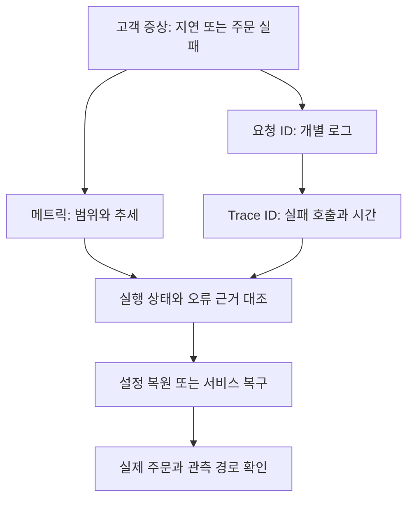

# 8장 최종 보고서 — 통합 장애 대응과 부하 관측

작성일: 2026-10-03 KST. 실습 기간: 2026-09-27~2026-10-03.
현재 작업 브랜치: `lab/008-integrated-incident`.

## 1. 결론

주문·결제 합성 서비스를 대상으로 정상 기준선, 결제 지연, 결제 중단, 응답 시간 초과를 관측하고 복구를 확인했다. 요청 ID와 Trace ID로 개별 요청의 로그·트레이스를 연결하고 수집 상태와 업무 성공이 다를 수 있음을 확인했다.

Docker 컨테이너에서 수행한 1→3→5 VU 단계 부하는 2080건 모두 성공했다. 유지 구간 처리량 근사치는 3.55→10.60→17.42건/초로 증가했고 p95는 약 83~84ms였다. 이번 시험 범위에서는 뚜렷한 성능 저하가 없었다.

**8장의 핵심 학습을 여기서 정리한다. 모든 계획 실험을 수행했다는 의미는 아니다.** 급증·지속 부하와 한계 초과 스트레스 시험은 미실행이며, 최대 용량·장기 안정성·운영 SLO 준수를 입증하지 않는다. 새 부하를 추가하지 않고 기존 표본으로 SLI·SLO·오류 예산을 해석했다.

## 2. 목적과 환경

목적: 실제 업무 증상에서 출발해 관측 자료로 실패 구간을 좁히고, 조치 후 같은 업무의 회복을 확인하며, 확인한 사실과 가설을 구분해 설명한다.

| 구분 | 구성 |
|---|---|
| 환경 | Windows 11, Git Bash, Docker Desktop/WSL2 |
| 업무 경로 | 클라이언트 → order-api → payment |
| 메트릭 | Prometheus 수집, Mimir remote_write·조회 |
| 로그 | Alloy·Loki |
| 트레이스 | 애플리케이션 계측·Tempo |
| 조회 | Grafana 및 HTTP API |
| 부하 생성 | 별도 grafana/k6:1.3.0 컨테이너 |

실제 금융 결제 시스템이나 영속 결제 원장은 없는 합성 애플리케이션이다. 응답 성공은 이 애플리케이션의 검증 조건을 만족했다는 의미다.

## 3. 단계별 수행 상태

| 단계 | 수행 내용 | 종료 판정 |
|---|---|---|
| [8-0 준비 점검](8-0-readiness.md) | 주문·메트릭·로그·트레이스 경로 | 핵심 경로 확인 |
| [8-1 기준선](8-1-baseline.md) | IPv4 5분 요청·연결 시간 비교 | 반복 측정 완료 |
| [8-2 지연](8-2-payment-delay.md) | 1초 지연·관측·복구 | 완료 |
| [8-3 중단](8-3-payment-outage.md) | payment 중지·주문 실패·관측·복구 | 완료 |
| [8-4 오류 유형](8-4-dns-timeout.md) | 이름 조회 실패와 timeout 비교 | 비교·복구 완료, 연결 거부 미실습 |
| [8-5 부하](8-5-load-results.md) | smoke 2회·단계 부하 | 부분 수행 완료, spike·soak·스트레스 미실행 |
| [8-6 품질 해석](8-6-sli-slo.md) | 기존 표본의 SLI·예시 SLO·오류 예산 | 해석 문서 작성, 운영 구현 미진행 |
| 8-7 통합 보고 | 결과·한계·다음 운영 과제 정리 | 본 보고서 작성 |

앞선 개별 문서의 다음 단계 문장은 그 기록 시점의 상태다. 최신 수행 범위는 이 표와 아래 미검증 목록을 기준으로 한다.

## 4. 주요 측정 결과

| 실험 | 관측 결과 | 의미 |
|---|---|---|
| 정상 IPv4, 300초 | 232건 모두 HTTP 201/종료 코드 0, 평균 82.646ms | 정상 비교 기준. 모든 본문 검사는 하지 않음 |
| 1초 지연, 300초 | 134건 모두 HTTP 201/종료 코드 0, 평균 1002.655ms | 성공 응답을 유지하면서 지연 악화 |
| 1초 지연 반복 후 복구 | 201/confirmed, 86.740ms | 단일 요청의 기능·지연 회복 |
| payment 중지 후 주문 | 502/payment_unavailable, curl 3799.442ms | 의존 서비스 중단이 주문 실패로 전파 |
| 중지 후 복구 주문 | 201/confirmed, 83.947ms | 기능 회복. 두 대상 up=1도 확인 |
| 별도 중지 진단 | URLError → gaierror, errno=-5, 4.010874초 | 새 재현에서는 이름 조회 실패 확인 |
| payment 3초 지연 | 주문 504/payment_timeout, 2.014662초 | 2초 제한 내 호출이 완료되지 않음 |
| timeout 실험 후 복구 | 201/confirmed, 86.822ms | 기본 지연 설정 복원 후 성공 |
| k6 단계 부하 | 2080건 업무 검증 성공, 중단된 반복 0 | 시험 범위 내 처리량 증가·지연 유지 |

순차 curl과 k6의 경로·연결 재사용·대기 시간·측정 구간이 다르다. 요청 수와 평균을 서로 직접 성능 우열로 비교하지 않는다. 단계별 백분위를 평균 내 전체 백분위로 만들지 않는다.

## 5. 장애 사례의 시간선

### 2026-10-03 payment 중단

| 시각 KST | 사건 |
|---|---|
| 07:52:17 | 정상 주문 201, 83.556ms |
| 07:55:03~07:55:08 | payment 중지 명령 실행 구간 |
| 08:02:22.939 | order-api 로그: 502/payment_unavailable, 서버 시간 4002.284ms |
| 08:33:39.754 | 수집 상태: order-api up=1, payment up=0 |
| 08:34:43 | payment 시작 명령 |
| 08:34:53 | 복구 주문 201, 83.947ms |
| 08:34:57.376 | 두 서비스 up=1 |

이 시간선에는 사용자의 수동 확인·학습 대기가 포함된다. 중지부터 복구까지를 시스템의 복구 성능이나 운영 MTTR로 일반화하지 않는다. 실제 자동 경보가 감지한 시간이나 운영자의 대응 SLA도 측정하지 않았다.

### 2026-10-03 timeout 비교

09:45:25에 504 응답과 2.014662초를 확인했다. 지연을 0.08초로 복원한 후 09:48:27에 201/confirmed와 86.822ms를 확인했다. 첫 시각은 응답 시각이며 장애 주입 시작 시각은 아니다.

## 6. 요청별 근거 연결

| 사례 | Request ID | Trace ID |
|---|---|---|
| 지연 단일 요청 | delay-1s-20261001T124017Z | 56415d9b5236bd48549f59d3c81bd008 |
| 중단 전 정상 | outage-before-20261002T225217Z | 8e2aacf62d05e854ff222054098755c9 |
| 중단 중 실패 | outage-down-20261002T230218Z | 62ace47d3129cb5dffb7f27f32631c15 |
| 중단 후 복구 | outage-recovery-20261002T233451Z | f565d35354582940aac6eea4d15c8aa3 |
| timeout | timeout-3s-20261003T004522Z | 3482ae471b7ca667df02f27d02763ea0 |
| timeout 후 복구 | timeout-recovery-20261003T004826Z | a5f6b8a4d14ac509f4029ad5d8f1577e |

중단 실패 트레이스는 order-api의 server span과 결제 호출 client span, 총 2개 span을 표시했다. 결제 client span의 약 4초는 order-api가 호출을 시도한 시간이다. payment 서버의 처리 시간이 아니다.

## 7. 확인한 사실과 추론의 경계

| 내용 | 판정 |
|---|---|
| payment를 중지했을 때 주문이 502로 실패하고 복구 후 201로 돌아옴 | 직접 관측 |
| 새 진단 호출에서 gaierror 발생 | 직접 관측 |
| 과거 8-3 주문의 약 4초도 같은 이름 조회 실패였음 | 가능성이 높지만 당시 exc.reason 미기록으로 미확정 |
| 과거 curl localhost 추가 약 200ms가 IPv6 fallback 때문 | IPv4 비교로 지지되지만 상세 연결 로그 없어 미확정 |
| payment timeout 이후 하위 처리가 계속될 수 있음 | 코드상 가능. 이번 요청의 실제 완료는 미확인 |
| CPU 제한 때문에 서비스가 느려졌거나 충분히 여유 있음 | 시험 중 자원 근거가 없어 모두 단정 불가 |

애플리케이션은 예외 클래스만 기록하고 내부 reason은 보존하지 않는 구현이다. 이번 진단은 별도 프로세스에서 동일 주소·urlopen·제한 값으로 재현했으며 런타임 애플리케이션 코드를 수정하지 않았다.

## 8. 서비스 품질 해석

단계 부하의 표본 업무 성공 SLI는 2080/2080=100%다. 전체 운영 기간의 가용성은 아니다.

설명용으로 99.9% 성공 목표를 같은 2080건에 적용하면 허용 실패량은 2.08건이다. 정수 요청 기준 실패 2건은 목표 내이고 3건은 초과한다. 실제 실패는 0건이다. 다른 실험의 502·504를 이 분모에 섞지 않는다.

운영 SLO는 기간·측정 경계·유효 요청·성공 및 지연 기준·누락 처리를 합의해야 한다. 이 장에서는 합의·구현·30일 준수 검증을 하지 않았다. 8-5의 자동 중단 기준을 운영 SLO로 사용하지 않는다.

## 9. 고객에게 설명할 핵심

[3분 이내 고객 설명 대본](8-customer-briefing.md)에 발표용 문장을 정리했다.

> 서버가 실행 중이더라도 결제 서비스가 중단되면 주문은 실패할 수 있습니다. 수집 상태, 요청 로그, 트레이스를 함께 확인해 실패한 호출을 좁히고, 복구 후 실제 주문 성공을 검증했습니다. 결제 지연과 호출 실패는 다른 증상으로 구분했습니다. 단계 부하에서는 5명의 가상 사용자가 요청을 반복하는 범위까지 실패와 뚜렷한 지연 증가가 없었습니다. 최대 용량이나 장기 품질을 검증한 결과는 아니며, 다음 단계에서는 이 증상을 감지하는 경보와 대응 절차를 마련합니다.

항상 모든 자료를 반복 조회하지 않는다. 각 단계에서 다음 조치가 달라지는 질문에 필요한 증거를 선택한다.

## 10. 미실행·미검증 항목

| 항목 | 부족한 증거 또는 미수행 내용 | 처리 |
|---|---|---|
| 급증·지속 부하, 스트레스 시험 | 실행 결과 없음 | 별도 심화로 이관 |
| 최대 처리량·운영 규모 예측 | 5 VU까지의 단일 PC 합성 시험 | 용량 보장 문구 금지 |
| 연결 거부 | 직접 재현 없음 | 미실습 표시 |
| 30일 SLO, 정확한 k6 200ms 충족률 | 장기 표본·원시 분포 확인 없음 | 운영 수집 설계 과제 |
| 자동 경보·장애 자동 복구 | 이 장에서 수신·해제·자동 조치 검증 없음 | 9장 경보·Runbook으로 연결 |
| 자원 제한 전체 적용 | 앱 메모리 512MiB만 화면 확인 | CPU·스왑·생성기 inspect 미제공 |
| 부하 중 자원 추세·CPU throttling | k6 없는 stats 한 장, 시각 불명 | 자원 병목 원인 단정 금지 |
| 시험 자동 중단 | 기준 초과 사례 없음 | 구현 설정과 실제 작동 검증 구분 |
| 부하 종료 후 별도 복구 요청 | 단계 부하 마지막 성공은 있으나 종료 후 추가 요청 없음 | 회복 시험 완료로 확장하지 않음 |
| timeout 뒤 결제 완료·중복 방지 | 하위 완료 로그·영속 원장·멱등성 구현 없음 | 설계 개념만 설명 |
| 약 4초의 resolver 세부 동작 | 호출 총 시간만 확인 | 후속 조사 |
| curl와 서버 시간 약 203ms 차이 | 측정 구간·시계 검증 없음 | 후속 조사 |
| 종료 코드 137·초기 255 종료·과거 out-of-order | 상세 종료·시계·원본 샘플 분석 없음 | 기존 미확정 사항 유지 |
| 무손실 관측 수집·이미지와 Git 코드 일치 | 전수 대조·digest 대조 없음 | 보장하지 않음 |
| k6 원시 파일 보존 완전성 | 파일 본문 미제공 | 콘솔 요약만 본 문서에 보존 |

7장의 테넌트 격리·재시작 후 과거 조회 등 이전 장의 미검증 과제를 이 보고서로 완료 처리하지 않는다.

## 11. 종료 시점 상태와 9장 인계

- 마지막 실제 timeout 복구 주문: 201/confirmed, 86.822ms.
- 이후 단계 부하도 전체 요청 성공으로 종료됐다.
- 제공된 마지막 stats에서 두 애플리케이션은 실행 중이며 메모리 상한 512MiB가 보인다.
- payment 기본 지연 0.08초로 복원하는 명령과 기능 복구는 확인했다. 이후 런타임 환경변수 재조회는 별도 제공되지 않았다.
- 실습 제한 overlay 해제 명령의 실행 증거는 없다. 원래 자원 정책으로 돌아갔다고 기록하지 않는다.
- spike·soak를 실행하거나 신규 장애를 추가하지 않고 8장 결과를 정리한다.

9장 우선 과제는 수집 대상 장애, 주문 5xx, 주문 지연을 구분해 경보 조건·지속 시간·저트래픽 처리·알림 경로를 설계하는 것이다. Runbook에는 고객 영향 확인, 로그·트레이스 진입 기준, 복구 명령, 실제 주문 재검증, 상위 담당자에게 전달할 근거를 담는다. 과거 3장의 Slack 수신 경험이 9장의 새 경보 검증을 대신하지 않는다.

## 12. 근거 자료

이 문서의 실행 근거는 8-0~8-5 문서에 연결된 사용자 출력과 화면이다. 추가 부하나 운영 작업은 수행하지 않았다. 기존 원본 CSV는 [requests-ipv4.csv](requests-ipv4.csv)로 보존되어 있다. 모든 화면·k6 원시 파일이 저장소에 포함된 것은 아니다.

- [8-5 부하 결과](8-5-load-results.md)
- [8-6 SLI·SLO·오류 예산](8-6-sli-slo.md)
- [k6 실행 가이드](../../experiments/008-k6-load.md)
- [자원 제한과 중단 기준](../../experiments/008-k6-limits.md)
- [실습 목차](README.md)

## 13. 커밋 전 검토 범위

2026-10-03에 보고서 수치·상대 링크·실행 가이드와 스크립트를 대조했다. 가이드에 남아 있던 현재 버전의 미실행 표기를 smoke·단계 부하 완료 상태로 수정하고, 자원 제한 및 자동 중단의 미검증 범위를 맞췄다.

Bash·JavaScript 문법과 YAML을 검사했다. 모의 HTTP 응답으로 정상 주문, 504, 잘못된 업무 상태, 잘못된 JSON, 통신 실패의 판정과 단계 경계·빈 요약·중단 설정을 확인했다. 이는 실제 k6 실행이나 Docker 제한 적용 시험을 대신하지 않는다. 실제 실행 근거는 사용자가 제공한 smoke·단계 부하 결과이며 검토 중 추가 부하를 발생시키지 않았다.

스크립트의 요청·검증·부하 로직은 기존 실행본을 유지했다. 실패 기준과 지연 측정 범위 설명은 k6 공식 [thresholds](https://grafana.com/docs/k6/latest/using-k6/thresholds/), [내장 메트릭](https://grafana.com/docs/k6/latest/using-k6/metrics/reference/), [사용자 정의 요약](https://grafana.com/docs/k6/latest/results-output/end-of-test/custom-summary/) 문서와 대조했다.
