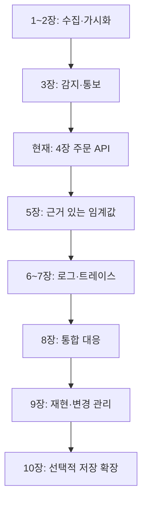

# Observability Lab 챕터 지도

## 목적과 진행 방식

주문 서비스의 이상을 감지하고, 영향을 파악하고, 원인을 추적하고, 복구를 입증한다.
도구 설치가 아니라 하나의 운영 질문에 답할 수 있는 범위를 챕터로 정한다.
한 세션은 60~90분을 가정한다. 시간은 계획 추정치이고 실제 수행 시간 측정값이 아니다.

완료 기준: 구조 설명 가능 → 소스 재현 가능 → 정상·이상·복구 검증 → 증거·한계·원복 기록.
실험 번호 001~006과 챕터 번호는 별개다. 실험 문서는 각 챕터의 증거로 연결한다.

| 장 | 운영 질문 / 범위 | 완료 기준 | 세션 | 상태 |
|---|---|---|---|---|
| 1 수집 기반 | 대상 메트릭을 가져오는가? Compose·Prometheus·Grafana·Git | up=1/0 비교와 원복 | 1~2 | 실습 완료 |
| 2 호스트 가시화 | Windows 자원을 설명할 수 있는가? exporter·대시보드·provisioning | 실제 CPU 부하 반영과 파일 기반 패널 | 2 | 실습 완료 |
| 3 감지·통보 | 화면을 안 봐도 이상을 아는가? Alertmanager·Slack·Gmail | 장애·복구 수신 및 CPU 실습 규칙 보관 | 2~3 | 기능 검증 완료 |
| 4 주문 API 가시화 | 주문이 느리거나 실패하는가? API·모의 결제·계측 | 요청량·지연·시스템 오류 구분 | 2~3 | 4-1 소스 준비, Windows 실행 확인 대기 |
| 5 초기 운영 기준 | 오픈 경고값을 어떻게 정하는가? 목표·부하·대응시간 | 임계값 근거와 반복 검증 | 2~3 | 예정 |
| 6 로그 조사 | 실패한 요청에서 무슨 일이 있었나? Alloy·Loki | 요청 식별자로 오류 검색 | 2 | 예정 |
| 7 트레이스 | 어느 처리 구간이 느린가? OpenTelemetry·Tempo | 주문·결제 구간 지연 식별 | 2~3 | 예정 |
| 8 통합 대응 | 감지부터 복구까지 입증할 수 있는가? 장애 주입 | 메트릭→트레이스→로그 보고서 | 2 | 예정 |
| 9 운영 재현성 | 팀이 안전하게 재구축·변경할 수 있는가? 버전·CI·배포·복구 | 새 환경 재현 및 변경 원복 | 2~3 | 예정 |
| 10 저장 확장 | 장기 보관·대상 증가에 대응하는가? Mimir | remote_write·조회·장애 영향 검증 | 2 | 선택 확장 |

1~3장은 관측 기반, 4~5장은 서비스 성능과 기준 도출, 6~8장은 원인 조사, 9~10장은 팀 운영과 확장이다.
다른 Windows PC의 실제 재현, 엄격한 이미지 버전 고정은 아직 완료하지 않았다.
CPU 실습의 15%는 기능 검증용이며 운영 성능 임계값이 아니다.

## 모든 챕터의 공통 흐름

목표 정의 → 현재 상태 확인 → 구성 → 정상 검증 → 부하·장애 실험 → 복구 → 증거 기록 → 실습 설정 정리.
실행 성공 전에는 완료로 기록하지 않는다. 알림 수신과 프로그램 로그, 추정과 실측을 구분한다.
한 번에 다음 실행 단계만 안내하고 그 결과를 확인한 후 이어간다.

## 4장 세부 순서

1. **4-1 정상 경로:** 주문 API → 모의 결제 호출, HTTP 201 확인.
2. **4-2 계측:** 요청 카운터·지연 histogram, /metrics, Prometheus 수집. 메트릭 라벨에 주문 ID를 넣지 않는다.
3. **4-3 이상 경로:** 통제 가능한 지연·시스템 오류를 주입하고 그래프로 구분.
4. **4-4 정리:** 정상 복구·증거 기록. 5장 성능 시험에 쓸 버전과 실행 조건 고정.

5장에서는 예상 피크·허용 지연·오류·조치 시간을 먼저 정의한다.
단계 증가·급증·지속 부하를 비교하고, CPU가 실제 병목인지 확인한다.
로컬 결과는 로컬 환경의 기준이다. 운영 서버에 그대로 일반화하지 않는다.

## 문서와 증거

- [파일·컨테이너 관계도](architecture.md)
- [4장 실행 가이드](chapters/04-order-api.md)
- [CPU 부하 관찰](experiments/2026-09-14-windows-cpu-load.md)
- [수집 중단 알림](experiments/003-windows-exporter-alerting.md)
- [Slack 수신](experiments/004-slack-notification.md)
- [Slack·Gmail 수신](experiments/005-slack-gmail-notification.md)
- [CPU 알림 검증](experiments/006-cpu-alert-validation.md)

실험 문서의 소스 미반영 표시는 작성 당시 상태일 수 있다. 현재 상태는 브랜치의 실제 설정과 함께 확인한다.
